Task 4.1
PART 1
1. DownloadMySQL server for your OS on VM.

2. Install MySQL server on VM.

I used sudo apt install mysql-server to install MySQL Server And sudo mysql_secure_installation to setup basic security parameters, such as root user password.

3. Select a subject area and describe the database schema, (minimum 3 tables)

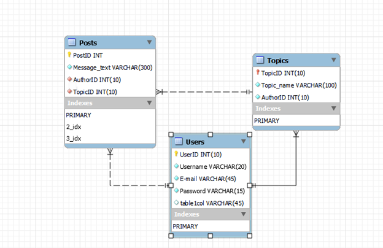

4. Create a database on the server through the console.

Create table Users (
UserID int(10) AUTO_INCREMENT,
Name varchar (20) NOT NULL,
Email varchar (45) NOT NULL,
Password varchar (15) NOT NULL,
PRIMARY KEY (UserID)
);

Create table Topics (
TopicID int(10) NOT NULL,
TopicName varchar(100) NOT NULL,
AuthorID int(10) NOT NULL,
PRIMARY KEY (TopicID),
FOREIGN KEY (AuthorID) REFERENCES Users (UserID)
);
Create table Posts (
PostID int(10) AUTO_INCREMENT,
MessageText varchar (300) NOT NULL,
AuthorID int(10) NOT NULL,
TopicID int(10) NOT NULL,
PRIMARY KEY (PostID),
FOREIGN KEY (AuthorID) REFRENCES Users (UserID),
FOREIGN KEY (TopicID) REFERENCES Topics (TopicID)
);

5. Fill in tables.

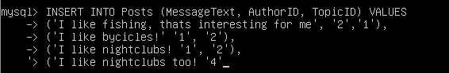
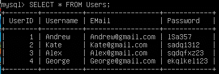
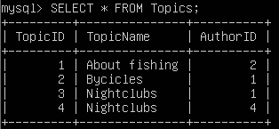
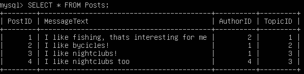

6. Construct and execute SELECT operator with WHERE, GROUP BY and ORDER BY.

SELECT COUNT(TopicID), MessageText 
FROM Posts
WHERE TopicID=3
GROUP BY MessageText
ORDER BY MessageText;
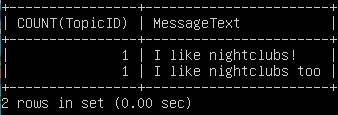

7. Execute other different SQL queries DDL, DML, DCL.

DDL - Data Definition Language It's a group of data definition operators. In other words, using the operators included in this group,we define the structure of the database and work with them, i.e. create, modify and delete them.

CREATE - used to create database objects;
ALTER - used to modify database objects;
DROP - used to drop database objects.
DML - Data Manipulation Language Data Manipulation Language (DML) is a group of operators for data manipulation. With the help of these operators, we can add, modify, delete and extract data from the database, i.e. manipulate them.

SELECT - selects data;
INSERT - adds new data;
UPDATE - changes existing data;
DELETE - deletes data. Data Control Language (DCL) is a group of data access control operators. In other words, their main task is permissions management. We can allow or deny the execution of certain operations on database objects using this operators.
GRANT - grants to user or group permissions for certain operations;
REVOKE - revokes granted permissions;
DENY - specifies a prohibition that has priority over permission.
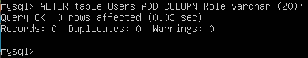
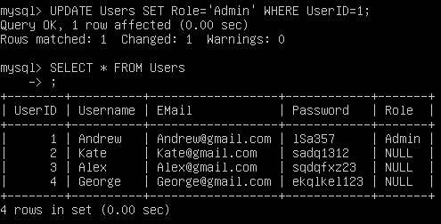
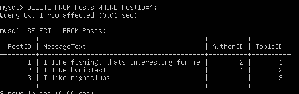

8. Create a database of new users with different privileges. Connect to the databaseas a new user and verify that the privileges allow or deny certain actions.

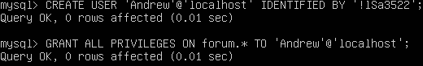
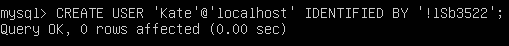
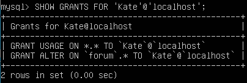
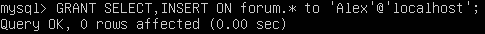
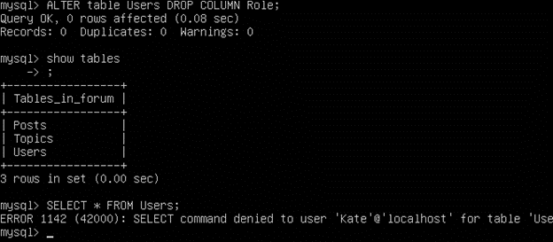
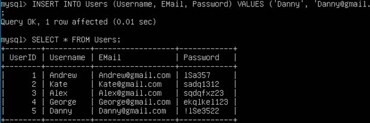

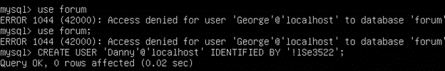

9. Make a selection from the main table DB MySQL.

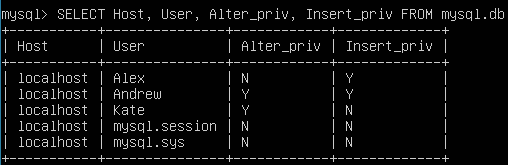

PART 2
10.Make backup of your database.

Mysqldump is a dedicated database backup utility. Dump is a file, usually with the sql extension, containing a set of sql statements (commands) for creating and filling tables in the database.

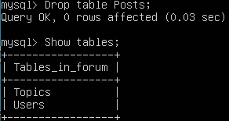

Sudo mysql -u root -p forum <forum.sql;>
Enter Password:

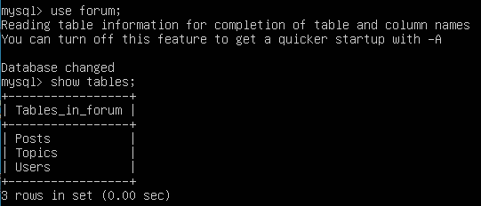

11.Delete the table and/or part of the data in the table.12.Restore your database.
13.Transfer your local database to RDS AWS.
14.Connect to your database.
15.Execute SELECT operator similar step 6.
16.Create the dump of your database
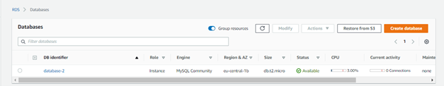
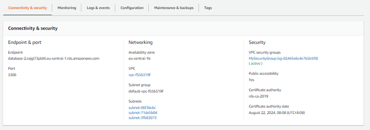
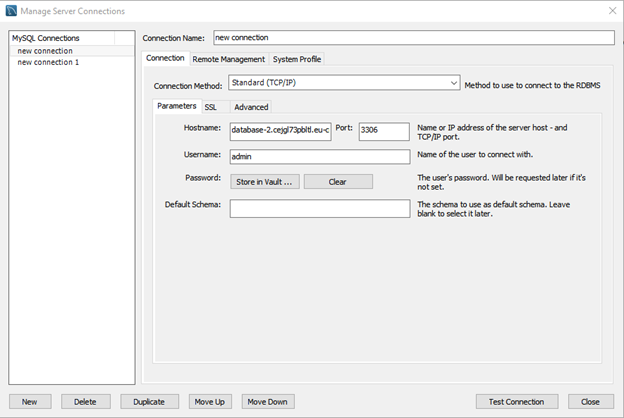
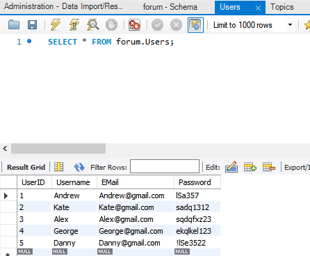
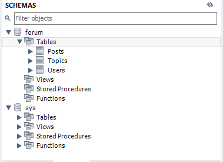
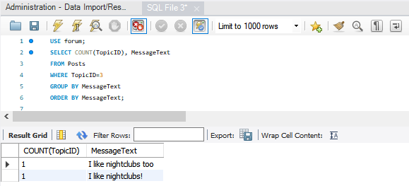

PART 3

17.Create an Amazon DynamoDB table
18.Enter data into an Amazon DynamoDB table.
19.Query an Amazon DynamoDB table using Query and Scan
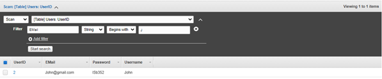
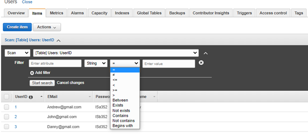
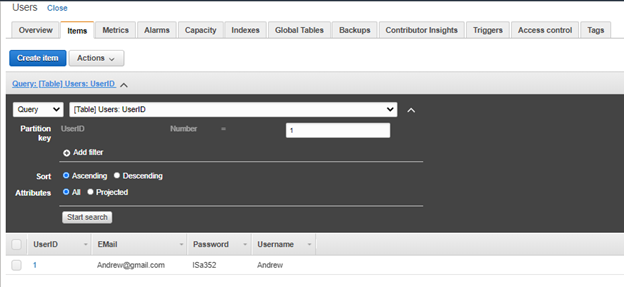
The query operation searches only for primary key attribute values and maintains a subset of comparison operators on key attribute values to refine the search process. The scan operation scans the entire table. You can specify filters which will be applied to the results to refine the values after full scan.